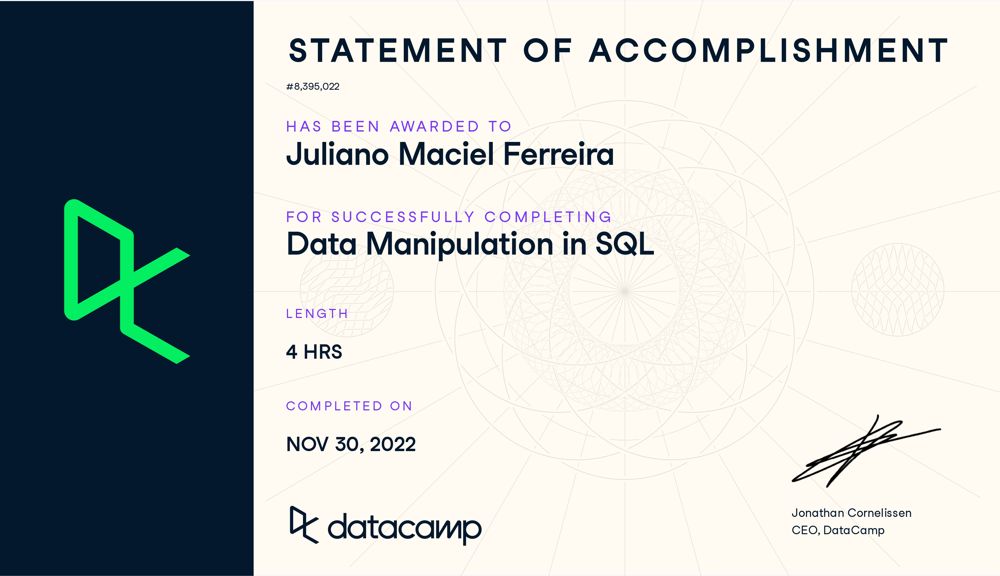

# My DataCamp Certifications

This is a repository to show the certifications of courses I made at [DataCamp](https://www.datacamp.com).

**I've subscribed [DataCamp](https://www.datacamp.com/pricing) for a long period of time and enjoyed the maximum I could**. Watching the videos and doing a lot of exercises (some are very funny, I have to say).

My DataCamp profile link is [https://www.datacamp.com/profile/julianomacielferreira](https://www.datacamp.com/profile/julianomacielferreira)

**In this moment I'm not working professionally as a Data-[Analyst, Engineer, Sciencist]** or using all the knowledge and tools I've learned from them, but I highly recommend people make a subscription and give a try.

In general, It'll improve your problem solving skills and they have real challenging exercises / projects with a strong pedagogy and best learn practices.

If you are a very curious person like me, I think [DataCamp](https://www.datacamp.com) is one of the best places to learn and practice Data Science fundamentals and related tools.

# Disclaimer

**This repository DOES NOT CONTAIN any copy, reproduction or adaptation of the content or exercises available in the courses (free or paid) at [DataCamp](https://www.datacamp.com).** 

# Courses

## Python

- [Introduction to Python](https://www.datacamp.com/courses/intro-to-python-for-data-science)
    - [My Statement of Accomplishment](https://www.datacamp.com/statement-of-accomplishment/course/a1c737b495efe9cea99c648e5ada6b29cad6246f?raw=1)

- [Intermediate Python for Data Science](https://www.datacamp.com/courses/intermediate-python-for-data-science)
    - [My Statement of Accomplishment](https://www.datacamp.com/statement-of-accomplishment/course/dff8042483c2d63e4fd012361f5504ae85c86497)

- [Python Data Science Toolbox (Part 1)](https://www.datacamp.com/courses/python-data-science-toolbox-part-1)
    - [My Statement of Accomplishment](https://www.datacamp.com/statement-of-accomplishment/course/5fb663f5265061cecf8da1ed7bac38e2a4c85d69)

- [Python Data Science Toolbox (Part 2)](https://www.datacamp.com/courses/python-data-science-toolbox-part-2)
    - [My Statement of Accomplishment](https://www.datacamp.com/statement-of-accomplishment/course/649ae12dcdd6a74241be7b418bedc4c0d3567c1f)

- [pandas Foundations](https://www.datacamp.com/courses/pandas-foundations)
    - [My Statement of Accomplishment](https://www.datacamp.com/statement-of-accomplishment/course/271e84307c14721709f0a64e9fa2fd5e43bcd2c3)

- [Data Manipulation with pandas](https://www.datacamp.com/courses/data-manipulation-with-pandas)
    - [My Statement of Accomplishment](https://www.datacamp.com/statement-of-accomplishment/course/8a8b93636c821b977575b443c48ce00fca4c59f7?raw=1)    

- [Data Types in Python](https://www.datacamp.com/courses/data-types-in-python)
    - [My Statement of Accomplishment](https://www.datacamp.com/statement-of-accomplishment/course/1709a42010355aa59586854876bbade2a9c65a76?raw=1)

- [Introduction to Data Science in Python](https://www.datacamp.com/courses/introduction-to-data-science-in-python)
    - [My Statement of Accomplishment](https://www.datacamp.com/statement-of-accomplishment/course/7d14a75d52923ea41820c7975439acabdd2449ad?raw=1)

- [Software Engineering Principles in Python](https://www.datacamp.com/courses/software-engineering-principles-in-python)
    - [My Statement of Accomplishment](https://www.datacamp.com/statement-of-accomplishment/course/6c21cd1e69e4f811300fbfc760dbe934926c05fc?raw=1)

- [Understanding Data Engineering](https://www.datacamp.com/courses/understanding-data-engineering)
    - [My Statement of Accomplishment](https://www.datacamp.com/statement-of-accomplishment/course/46c1af03bd6be2d91dea40c0ed0c6a89f8ab8d8b?raw=1)

- [Understanding Data Visualization](https://www.datacamp.com/courses/understanding-data-visualization)
    - [My Statement of Accomplishment](https://www.datacamp.com/statement-of-accomplishment/course/2d6d563ac858e3df60ba157bebd7589052dc141e?raw=1)

- [Writing Functions in Python](https://www.datacamp.com/courses/writing-functions-in-python)
    - [My Statement of Accomplishment](https://www.datacamp.com/statement-of-accomplishment/course/b50b8d8ae38f4d305a7216d77d90b9e05b288190?raw=1)       

## R Language

- [Introduction to R](https://www.datacamp.com/courses/free-introduction-to-r)
    - [My Statement of Accomplishment](https://www.datacamp.com/statement-of-accomplishment/course/dd4f14a631789f3c530e6ed39390a859cdd03783)

- [Intermediate R](https://www.datacamp.com/courses/intermediate-r)
    - [My Statement of Accomplishment](https://www.datacamp.com/statement-of-accomplishment/course/1f97c8f9424d374269ea3b4b493fa8deb3d8643b)

## SQL

- [Intro to SQL for Data Science](https://www.datacamp.com/courses/intro-to-sql-for-data-science)
    - [My Statement of Accomplishment](https://www.datacamp.com/statement-of-accomplishment/course/bb54f5f2afc841d009c5dea2c74b922db6b30d0c)

- [Intermediate SQL](https://www.datacamp.com/courses/intermediate-sql)
    - [My Statement of Accomplishment](https://www.datacamp.com/statement-of-accomplishment/course/91741200e453f8ae46b35b3191c9db63f24d91b2?raw=1)

- [Joining Data in SQL](https://www.datacamp.com/courses/joining-data-in-postgresql)
    - [My Statement of Accomplishment](https://www.datacamp.com/statement-of-accomplishment/course/5749fd1f74d72d9a45c7f8376219902aedf4be4a)

- [Data Manipulation in SQL](https://www.datacamp.com/courses/data-manipulation-in-sql)
    - [My Statement of Accomplishment](https://www.datacamp.com/statement-of-accomplishment/course/b9e60dd0a364505b3ef3aee6c54de20b75695a9e?raw=1)    

## Shell Script

- [Introduction to Shell for Data Science](https://www.datacamp.com/courses/introduction-to-shell-for-data-science)
    - [My Statement of Accomplishment](https://www.datacamp.com/statement-of-accomplishment/course/378328f64bfd40ee29d65b53782c74ec6f13e6e1)

## Git

- [Introduction to Git for Data Science](https://www.datacamp.com/courses/introduction-to-git-for-data-science)
    - [My Statement of Accomplishment](https://www.datacamp.com/statement-of-accomplishment/course/e0a254afea6eeb5919620d815a90c8af2bdb64a6)

# Certifications

# References

- [DataCamp](https://www.datacamp.com)
- [Wikipedia](https://en.wikipedia.org/)
    - [Data Science](https://en.wikipedia.org/wiki/Data_science)
    - [Data Analysis](https://en.wikipedia.org/wiki/Data_analysis)
    - [Statistics](https://en.wikipedia.org/wiki/Statistics)
    - [Exploratory data analysis](https://en.wikipedia.org/wiki/Exploratory_data_analysis)
    - [SQL](https://en.wikipedia.org/wiki/SQL)
- [Python](https://www.python.org/)
- [Pandas - Python Data Analysis Library](https://pandas.pydata.org/)
- [NumPy - package for scientific computing with Python](https://numpy.org/)
- [Project Jupyter](https://jupyter.org/)
- [R Language](https://www.r-project.org/)
- [R Studio](https://www.rstudio.com/)
- [Git](https://git-scm.com/)

# License

Please see the [license agreement](https://github.com/julianomacielferreira/datacamp-certifications/blob/master/LICENSE).